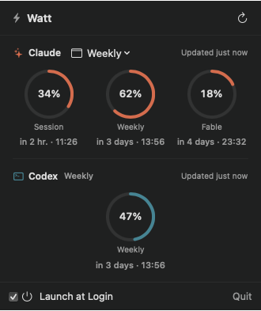

# Watt

Watt is a lightweight, native macOS menu-bar app for monitoring Claude Code and Codex subscription usage. It detects Claude Code and Codex when they are installed, shows the limits that matter at a glance, and stays out of the Dock.



## Install

Watt requires macOS 14 or newer on Apple Silicon, plus Claude Code and/or Codex installed and signed in.

```sh
brew install --cask josipmusa/tap/watt
open -a Watt
```

Watt is not currently notarized. If macOS blocks it, try opening Watt once, then go to **System Settings › Privacy & Security** and choose **Open Anyway**. Alternatively, remove only the quarantine attribute and open Watt:

```sh
xattr -dr com.apple.quarantine /Applications/Watt.app
open /Applications/Watt.app
```

## Use without Homebrew

Download the latest `Watt-*-macos-arm64.zip` from [GitHub Releases](https://github.com/josipmusa/watt/releases/latest), unzip it, and move `Watt.app` to `/Applications`. Open it from there.

The same macOS security prompt described above may appear.

## Usage

Launch Watt and click its menu-bar item to see current usage and reset times for Claude Code and Codex. You can choose which limit to show in the menu bar and enable **Launch at Login** from the bottom of the popover if wanted.

On first use with Claude, macOS may ask for access to the `Claude Code-credentials` Keychain item. Choose **Allow** or **Always Allow** so Watt can request Claude usage. Codex authentication remains managed by Codex itself.

## Privacy

Watt has no analytics, telemetry, third-party backend, or third-party dependencies. It requests usage directly from Anthropic and Codex, never reads prompts, conversations, projects, or source code, and does not persist OAuth tokens.

## License

[MIT](LICENSE)
